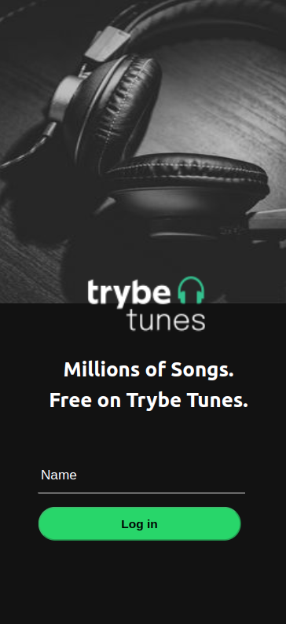

# Projeto TrybeTunes

Projeto desenvolvido durante o curso da Trybe para fixação de aprendizados. Foi proposto para criar uma aplicação de músicas no React, utilizando a API do iTunes, em que ela é capaz de:

* Fazer login;
* Pesquisar por uma banda ou artista;
* Listar os álbuns disponíveis dessa banda ou artista;
* Visualizar as músicas de um álbum selecionado;
* Reproduzir uma prévia das músicas deste álbum;
* Favoritar e desfavoritar músicas;
* Ver a lista de músicas favoritas;
* Ver o perfil da pessoa logada;
* Editar o perfil da pessoa logada;

Nesse projeto tive a habilidade de fazer requisições e consumir dados de uma API, utilizar ciclos de vida de componente, utilizar o BrowserRouter, criar rotas mapeando o caminho da URL via Route e links de navegação na aplicação com o componente Link.

